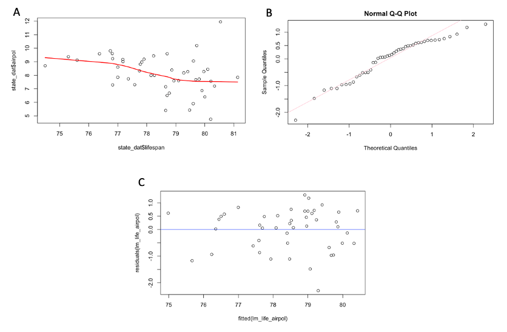
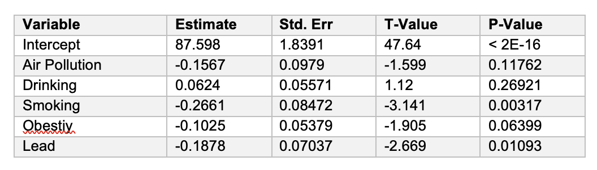
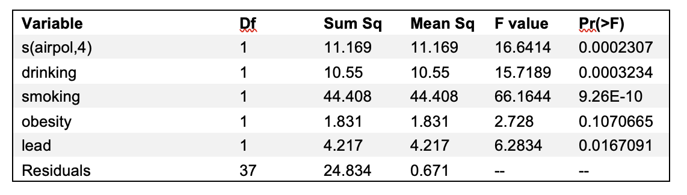

## Linear Assumptions 
Data exploration (Fig 2) identified that the data appeared to generally fit the assumptions of the linear model. The assumptions of the linear model are as follows: a linear relationship between the dependent and independent variables, lifespan, and air pollution respectively; independence assumption, normal distribution, and equal variance. The normality assumption is challenged as demonstrated by the QQ plot (Fig 2C), although this may be on account of sample size differences of cities evaluated in each state. As demonstrated by Fig 2A, there appears to be a slight negative correlation between air pollution and life span (R=-0.339), suggesting states with less air pollution may have higher average lifespans. 

## Results of Simple Linear Model

Potential demographic covariates were chosen based on contribution to lifespan and thus lead exposure, obesity, diabetes, binge drinking, and smoking were evaluated. Models comparing exclusion of each demographic covariate were evaluated and the best model was selected based on AIC, which identified the inclusion of all covariates as numeric variables as the optimized model. The results of the model are reported in Table 1, which identified a significant association between lifespan and air pollution, with smoking and lead exposure as having statistical significance among the evaluated covariates. The interpretation of these results are such that an increase in one percent of population that smokes results in a decrease of 0.266 years of average lifespan compared to a population without a one percent increase in smoking and a 0.188 decrease in average lifespan among states with a one percent increase in population with lead exposure as compared to states without a one percent increase in lead exposure.

Table 1. 

### Secondary Analysis 

The secondary analysis evaluated variations of the generalized linear model on account of the loose fitting of the dataset to the normality function. Additional models including the quadratic, spline and additive models allow for linear modeling with the inclusion of non-linear parameters. The final model was the generalized additive model (GAM) to account for potential non-linear relationship between air pollution and lifespan. The GAM model included the same covariates as the generalized linear model and outperformed all considered models with respect to visual fit and AIC, with results reported in Table 2. 

Table 2.
Table 1. 

